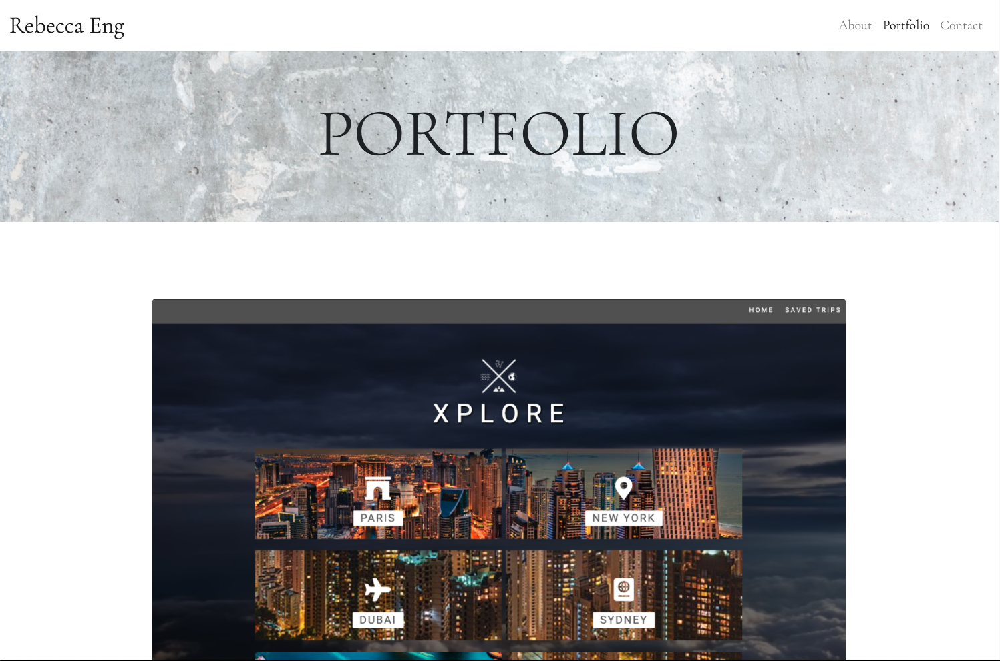

# Portfolio - Rebecca Eng

## Summary
Welcome to my portfolio! I created this website to display projects that demonstrate my style and abilities as a web developer. I utlized the Bootstrap framework in conjunction with HTML and CSS to build my portfolio as a responsive site. By using a responsive layout, my portfolio renders well on a variety of devices, everthing from phones to tablets to computers. This website will continue to be updated as more projects become available to share.

## Features
* Express was used to create HTML routes that serve static HTML files for each page view
* The application is hosted and deployed on Heroku 
* Bootstrap was used to create the responsive layout of this website
    * The nav bar at the top of each page renders as a toggle button on smaller screens and as links on larger screens
    * Boxes and their content resize to fit the size of any screen

* The Bootstrap grid system was used to create a series of containers, rows, and columns in order to produce a responsive layout
    * The main section on each page is comprised of a container that holds row(s) and column(s)
    * The portfolio page contains rows, columns, sub-rows, and sub-columns in order to display the grid of images

* The AOS library is utilized to add animation to images and cards when a user scrolls

* A sticky footer was used to keep the footer at the bottom of the pages

## Built With
* [Express](https://expressjs.com/)- back end web application framework for Node.js for building web applications and APIs
* [Node.js](https://nodejs.org/en/) - JavaScript runtime environment that executes JavaScript outside the web browser
* [Bootstrap](https://getbootstrap.com/) - used to create the mobile responsive layout
* [HTML](https://developer.mozilla.org/en-US/docs/Web/HTML) - used to create the structure of the page
* [CSS](https://developer.mozilla.org/en-US/docs/Web/CSS) - used to style HTML elements on the page
* [AOS Library](https://michalsnik.github.io/aos/) - Animate on Scroll library used to animate images and cards when a user scrolls
* [Heroku](https://heroku.com) - used to deploy website
* [Git](https://git-scm.com/) - version control system used to track changes in source code
* [GitHub](https://github.com/) - hosts repository and deploys page on GitHub

## Deployed Link
[View portfolio](https://engrebecca-portfolio.herokuapp.com/)

## Site Picture

## Author
* Rebecca Eng
* [GitHub](https://github.com/engrebecca)
* [LinkedIn](https://www.linkedin.com/in/engrebecca/)

## Credits
* Background image from [Unsplash](https://unsplash.com/images/stock)

## License
This project is licensed under the MIT license